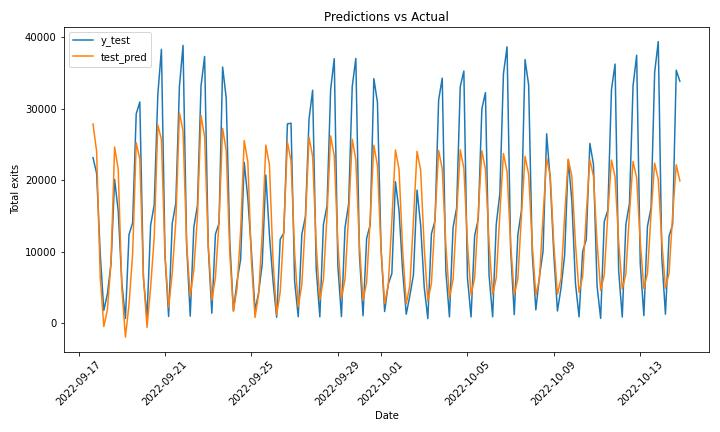
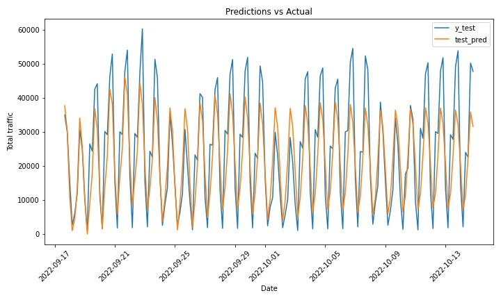

#  Project 4: Group Project

## nyc_subway_traffic
Group project for GA DSI-822, group 2

### Included in this repository:

- app directory
    - app.py -- python file for the streamlit webapp
- archive directory
    - Files that are not relevant to the finished project
- notebooks directory
    - 01 Data Download -- notebook used to pull and clean data from MTA website
    - 02 EDA -- notebook used to explore the data
    - 02.5_EDA_holidays -- notebook used to explore the data further for certain days and certain stations
    - 03_Download_process_data_from_single_station -- notebook used to automatically prepare necessary data for modeling
    - 04_Preprocessing_Modeling -- notebook used to determine the best ARIMA model
    - 05_Model_Generator -- notebook used to generate models for the target (most-trafficked) stations
    - 06_Station_Mapping -- notebook used to visualize the subway stations on a map of NYC
- resources directory
    - Charts generated through EDA
    - Maps created from the Station_Mapping notebook
- slides directory
    - Slides used for project presentation

## Problem Statement

The New York City Subway is one of the world’s oldest and most-trafficked public transit systems in the world, that serves almost one billion people annually and keeping its systems up to date is not an easy task. For that purpose, MTA (NYC Subway operator company) would like to know what is the best time to provide station maintenance that would affect as few passengers as possible. As a data science team, working for a company we’ve been tasked to solve that issue by building a model that can predict these time intervals. Project success will be evaluated using the resulting RMSE and MAPE metrics. The model’s goal will be to reduce these metrics as low as possible and be well under the baseline prediction of the average value.
In addition, the company would like to use this model as a recommendation system that would predict station load for passengers and help them avoid possible close contact with other passengers considering epidemiological situation in the world (to avoid the spread of COVID).

---

Planned steps for the implementation of the project:
Download all necessary data from MTA website
Conduct basic data check and EDA
Create a time series model
Develop a basic webapp to check usability of the model for passengers
Visualize the data overlaid on a map of NYC 

 ---

## Data Collection

Our primary database was pulled from the [MTA website](http://web.mta.info/developers/turnstile.html). Here they have turnstile data for every station in NYC broken down into weekly files. We decided to pull a year’s worth of data in order to have sufficient data with which to train our model and account for any seasonality that may appear. A year’s worth of data amounted to roughly 11 million rows.

---

## Data Cleaning & EDA

The data from the MTA website is quite complete, so there was no need to address any null values initially. The data is also consistently formatted, which helps. Our first step was to convert the date and time into datetime format for us to work with easily using pandas. We then set our index as both the station and the datetime for modeling.

After setting up our dataframe, we then dove deeper into the data to look for any anomalies. Several turnstiles showed negative values in their entries and/or exits, for one. Here we assume that they are counting properly (just in the opposite direction), so we took the absolute value for any negative amounts.

There were also instances where a turnstile was showing a value far higher than what is feasible. Logically, in a given period of four hours the theoretical maximum number of people that could pass through a turnstile is 15,000 (a little more than one person per second). In cases where the value was higher than 15,000 for a period we adjusted the values to reflect the mean for that station instead.

We’ve checked the entries and exits overall for both the most trafficked and least trafficked stations. We also visualized the number of riders per day. It is interesting to note that overall there are significantly more exits than there are entries. This suggests that either several of the entry turnstiles are not functioning, or perhaps there are a significant number of riders who are “jumping” the turnstile in order to avoid payment. 

In addition to plotting the entries and exits from a variety of perspectives, we also conducted basic statistical analysis on the data, to show how the load differs per station/line and for different time periods (week, months, year). The volume of riders is actually pretty consistent throughout the year other than during the holidays – ridership is significantly decreased during December and early January.

After cleaning the data for any clearly incorrect values, we then dropped any columns that are irrelevant to our goals for the project. Now we have our cleaned dataframe to use for modeling.
We then looked at the passenger flow at the most loaded stations for the biggest holidays and major event days like Christmas, Thanksgiving, the NY Marathon etc.. We found which stations get most passengers and compared the load for certain stations at different holidays.

---

## Preprocessing & Modeling

#### Preprocessing

We decided to use an ARIMA model for our turnstile data since we were looking at time series data, and wanted to forecast future traffic without needing to look too far ahead in time.

In order to implement an ARIMA model, we first needed to check whether our data exhibited stationarity. This is done by means of the Augmented Dickey-Fuller test. Our first iteration of the test returned a p-value very close to zero for both the entry and exit data, significantly lower than our alpha of 0.05. This tells us that our data is stationary.

We then looked at the autocorrelation (acf) and partial-autocorrelation (pacf) plots for each set of data. Both acf plots looked similar – there was significant correlation shown for every lag of 6. This is because each lag of 6 marks a full day (data is broken up into 4-hour blocks). At 42 we see our highest correlation, which marks a full week. This indicates that the entry and exit patterns are roughly the same for each day of the week (i.e. the Monday traffic patterns are all similar to one another, the Friday patterns are also all similar, etc.).

The pacf plots showed us that some of the correlation from the acf was due to lags having a correlation to the lags in between the first lag. The multiples of 6 still stand out as the most statistically significant, but it turns out several other points are significant as well on the negative end. This is likely due to weekday traffic being strongly similar at similar times of day, and drastically different from the other time periods.

#### Modeling

The Augmented Dickey-Fuller test showed that our data was stationary, which means we did not need to difference our data and that the d-value of our model (or the I in ARIMA) is zero. So instead we are looking at an AR, MA, or ARMA model. We used GridSearch to determine the best p-value (AR) and q-value (MA) for our data. Doing so gave us the best model for minimizing error as an AR-19 model. After running a grid search on the model the moving average portion showed to be insignificant so we ran with a regular AR model. We created and evaluated models for the entries, exits, and traffic for 34th St. Penn Station. This station was used since it was one of the stations with the highest traffic. After creating simple AR models, a rolling forecast model was created using the optimized parameters for the AR models. The rolling model had the highest performance since it was able to use new data to help predict predictions farther in the future.

–-

## Evaluation

#### Model evaluation

First base models using the mean of the column being predicted were created.

Baseline Metrics:

|Variable|MAPE|RMSE|
|---|---|---|
|Entries|248%|5478 entries|
|Exits|244%|11750 exits|
|Traffic|242%|16587 people|

 - For all of the baseline metrics the MAPE is around 240%. Since the data fluctuates between the average some of the predictions end up being correct. The resulting RMSE is high, but not as high as it could be if the data trended in a specific direction. 

Optimized AR Metrics:

|Variable|MAPE|RMSE|MAE|
|---|---|---|---|
|Entries|169.18%|4507 entries|3947 entries|
|Exits|64.29%|6337 exits| 4842 exits|
|Traffic|64.7%|9190 people|7375 people|
|Rolling Entries|41.9%|2356 entries|1595 entries|

- As with the trend for autoregressive models as you try and forecast farther into the future the predictions start to just become the average since they can't add new data to pick up the trends. This model has a mean absolute percentage error of 169% which is quite high. The RMSE is 4507, which is high since the min and max values are 207 and 22897 entries. The MAE tended to be a bit lower than the RMSE, but was still significantly large.

- For the exits the metrics are much better. The amount of exits seems to be less volatile compared to the entries. Thus having a lower mean absolute percentage error. The RMSE is actually higher than the entries however since the quantity of exits is overall higher than entries. 

- By adding up the entries and exits we can get an estimate for the traffic of a station at given time. The metrics for the MAPE are around the same as the metrics for the number of exits. The RMSE is higher because it is the sum of the entries and exits, but it's similar MAPE shows it's classifying around the same error percentage.

- Looking at the graph we can see it matches much more closely to the actual predictions. Our RMSE is much lower than our first AR model being almost half. Our MAPE is nearly a quarter of the value at 42% versus the 169% seen in the original model. This is how a model should be implemented as it needs to continually bring in data to predict future dates. However, how long we decide to predict into the future and how often we update our model would have to depend on the resources we have for computing and the data we are allowed access to.

#### Visualizing the stations

Longitude and latitude data for each station was pulled in from [data.ny.gov](https://data.ny.gov/) in order to plot the subway stations on a map. We leveraged [Folium](http://python-visualization.github.io/folium/) in order to overlay the stations onto a visually pleasing map of New York City:

Showing all of the stations on the same plot proved to be hard to read:

Visualizations were made in a variety of different perspectives, including highlighting only the most popular stations and clustering stations with their nearest neighbors to show how the stations are spread throughout the four boroughs:

A goal for expanding upon the project would be to add additional layers to the stations mapped, such as incorporating the models onto each station and graphically showing traffic predictions as you hover over each station.

#### Web application

The preliminary app was created for the 11 most popular stations using streamlit. It lets the user choose the station, choose the date that they’re planning on traveling (for the purpose of this project, we only have data saved up to Oct, 14, so the model would work best for the week after that date). Also it lets the user choose the time they’d like to arrive at the station and the amount of passengers that are going to be traveling. As a result, the app gives the price for the trip, tells a user how many people are expected to be at the station during a chosen time slot and whether or not it is advised to travel. For the expected amount of people, we chose the prediction from our model. The criteria for how busy the station is was chosen arbitrarily. 

---

## Conclusion & Recommendations

Our model can successfully predict the best time of station maintenance. We recommend stakeholders use this model in the process of scheduling regular works.

The app that was developed can also be used by passengers to see when is the best time to travel to avoid exposure to COVID. The app is running, but it’s only for 20 stations. There are 472 stations in the NYC subway system. To proceed further it would be great to add more stations to the app, meaning building and running more models (optimizing the procedure). Also the criteria for how busy a station is was decided arbitrarily, in ideal world the result should be compared to the mean value of the passenger traffic for this time slot for a certain station, since some stations are way more loaded then the others. 

Another future recommendation would be to add the map from the station mapping to the app to increase the effectiveness and the usability of the app. Ideally it would be loaded so that the user would interact directly with the map, clicking on their stations of choice to pull up the desired information.

The strongest and most accurate model was the rolling forecast model. It accurately captured trends in the data while not simply predicting the average of the data. For production we went with the AR model since there was a lot more implementation needed for a rolling average model. To improve our simple AR model more lags could be looked at since not all of the statistically significant lags were used. After looking at models with more lags the insignificant lags could be dropped to get a model with more significant lags, but less complexity. Finally the models were based around a single station since there are so many. Theoretically each station would have its own optimized parameters, but having to run that for nearly 400 stations wasn’t feasible here. 
